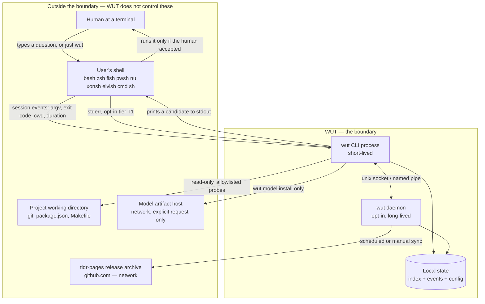
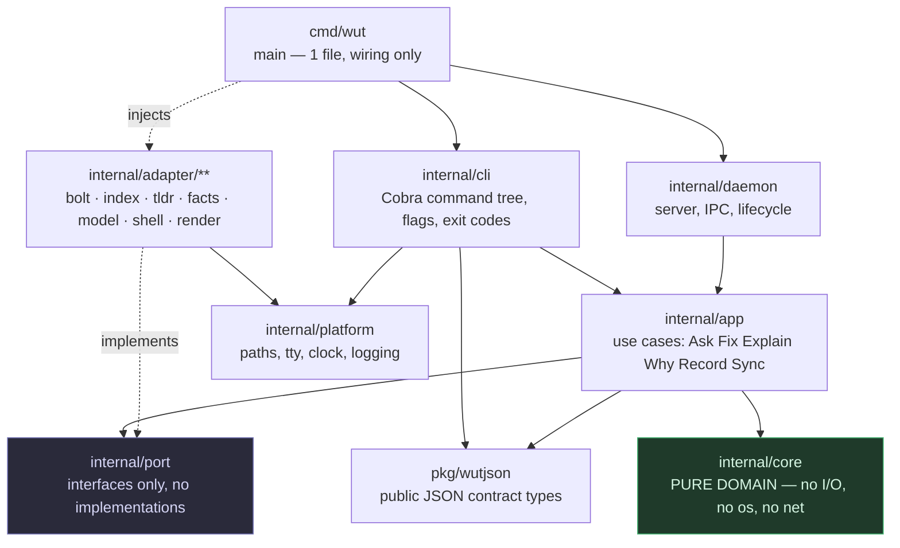
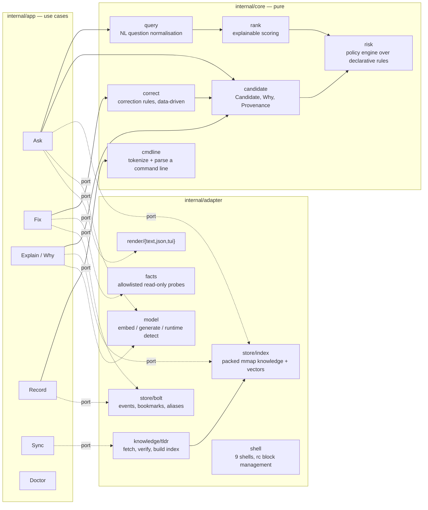
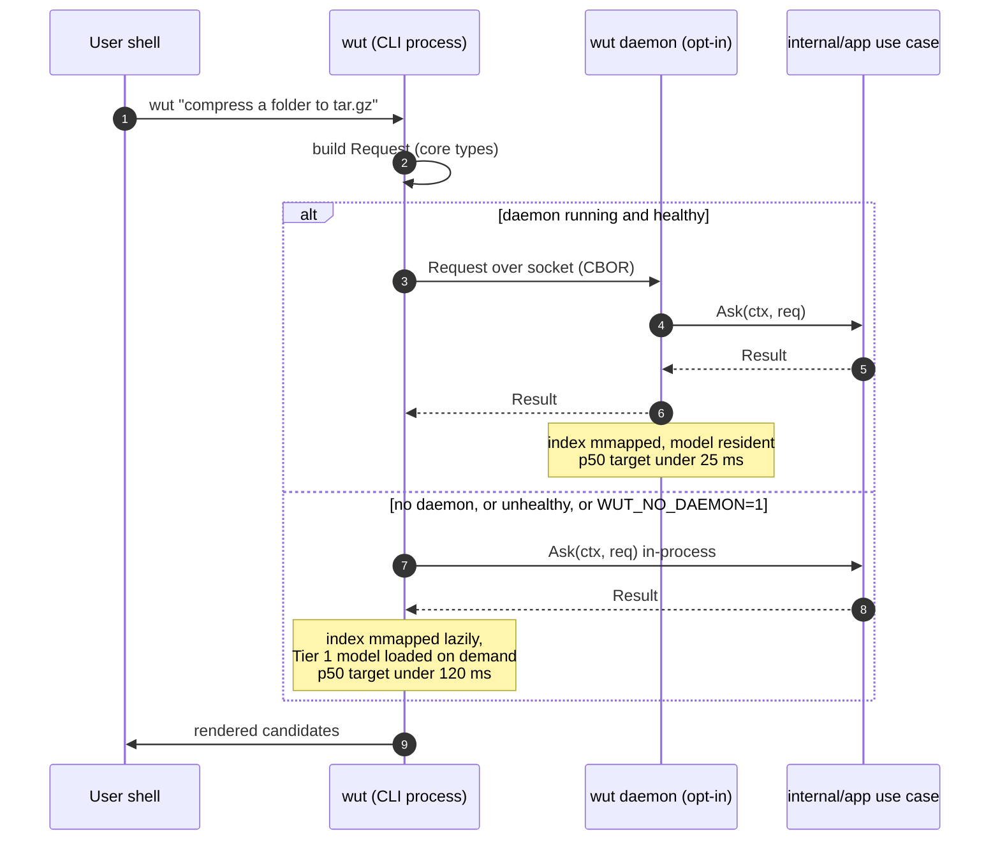

# 02 — Architecture Overview

> Status: **Implemented**. Every boundary here is enforced by a test in `internal/arch`.

## 1. The shape in one sentence

WUT is a **ports-and-adapters (hexagonal) Go application**: a pure domain
core with no I/O, a thin use-case layer, and replaceable adapters for the
terminal, the shell, storage, the tldr network source, and the local model —
with an **optional daemon** that hosts exactly the same use-case layer behind a
local socket so the model and the index stay warm.

The single binary is both the CLI and the daemon. There is no second artifact.

## 2. System boundary

What WUT owns, what it touches, and what it must never do.



**Boundary invariants** (each is enforced by a test, see
[09](09-quality-release.md) §3):

| # | Invariant |
|---|---|
| B1 | WUT never executes the user's command, in any mode, on any path. |
| B2 | Every process WUT does start comes from a compile-time allowlist compared **argv-for-argv**, and is read-only. |
| B3 | WUT writes only inside its own data/config/state directories, plus the managed block in an rc file during `wut shell install`. |
| B4 | Network egress happens only in `wut db sync` and `wut model install`, both of which name their host in the code and verify a checksum. |
| B5 | No telemetry. No process ever sends user data anywhere. |

## 3. Layers and the dependency rule



**The dependency rule, stated as something CI can check:**

| Package | May import | Must never import |
|---|---|---|
| `internal/core/**` | stdlib pure packages only (`strings`, `sort`, `fmt`, `errors`, `time` types) | `os`, `net`, `os/exec`, `io/fs`, any `internal/adapter`, any `internal/app` |
| `internal/port` | `internal/core`, `context` | any adapter |
| `internal/app` | `internal/core`, `internal/port`, `pkg/wutjson` | any `internal/adapter`, `internal/cli`, `internal/daemon` |
| `internal/adapter/**` | `internal/core`, `internal/port`, `internal/platform`, stdlib, third-party | `internal/app`, `internal/cli`, another adapter's internals |
| `internal/cli` | `internal/app`, `internal/port`, `pkg/wutjson`, `internal/platform` | `internal/adapter/**` (it receives them, it does not construct them) |
| `cmd/wut` | everything — this is the only place adapters are constructed | — |

This is the direct answer to the prototype's "no seam" problem (audit §2: `cmd/`
constructs `db.Storage` in 12 files, viper singleton read by 17). In WUT there
is exactly **one** construction site.

## 4. Ports

Every port lives in `internal/port`, is an interface, and has at least two
implementations: the real adapter and an in-memory fake used by tests.

```go
// internal/port — illustrative, not final.

type KnowledgeSource interface {
    Lookup(ctx context.Context, name string, plat core.Platform) (*core.Page, error)
    Search(ctx context.Context, q core.Query, limit int) ([]core.Hit, error)
}

type VectorIndex interface {
    Nearest(ctx context.Context, vec []float32, limit int) ([]core.Hit, error)
}

type EventStore interface {
    Append(ctx context.Context, e core.Event) error
    Recent(ctx context.Context, f core.EventFilter) ([]core.Event, error)
}

type FactProvider interface {           // read-only, allowlisted, lazy, memoised
    Facts(ctx context.Context, cwd string) core.Facts
}

type Embedder interface {               // Tier 1 model — always available
    Embed(ctx context.Context, texts []string) ([][]float32, error)
}

type Generator interface {              // Tier 2 model — may be absent
    Available() bool
    Generate(ctx context.Context, req core.GenRequest) (core.GenResult, error)
}

type Presenter interface {              // text | json | shell | tui
    Present(ctx context.Context, r core.Result) error
}

type ShellIntegration interface {
    Detect() ([]core.Shell, error)
    Render(core.Shell) (string, error)   // the managed rc block
    Install(core.Shell, core.InstallOpts) (core.InstallReport, error)
}

type Clock interface{ Now() time.Time }
```

`KnowledgeSource` is the extension point that keeps owner decision D4
reversible: adding `man`/`--help` later means adding one adapter, not touching
`internal/app` or `internal/core`.

## 5. Module map



### Package responsibilities

| Package | Owns | Does **not** own |
|---|---|---|
| `core/cmdline` | Turning `git psuh -u origin main` into a `CommandLine` (program, subcommand, flags, operands) across shell quoting rules | Deciding anything is wrong |
| `core/correct` | Correction rules and their application; rules are loaded as data | Running probes; it *asks* `Facts` |
| `core/candidate` | The `Candidate` type, `Why` provenance, merge and dedupe semantics | Producing candidates |
| `core/rank` | Turning signals into a score and an explanation for that score | Where signals came from |
| `core/risk` | Classifying a candidate against a declarative policy | Blocking (that is the caller's decision) |
| `app/*` | Orchestrating a user-visible operation end to end | Formatting, storage details, process spawning |
| `adapter/facts` | The **only** place `os/exec` appears outside the daemon supervisor | Deciding what a fact means |
| `adapter/model` | Loading, mmapping, and invoking models; detecting what the machine can run | Prompting policy (that is `app/explain`) |
| `adapter/shell` | rc file surgery, backups, hook text for 9 shells | Interpreting events |
| `daemon` | Lifecycle, socket, request routing, warm caches | Any business logic — it calls `internal/app` like the CLI does |

## 6. Two runtimes, one code path

This is the property that keeps the daemon from becoming a second
implementation ([ADR-0009](10-decision-records.md)).



The daemon is a **transport**, not a tier. If it is missing, slow, or wedged,
the CLI silently runs the same use case in-process. There is no feature that
exists only with the daemon — only latency differs, plus Tier 2 generation
becoming practical ([05](05-daemon.md) §4).

## 7. Cross-cutting decisions

| Concern | WUT approach | Replaces (the prototype) |
|---|---|---|
| Configuration | Typed struct, explicit precedence, atomic write, no global | viper singleton, 17 readers (audit §2) |
| Concurrency | `errgroup` inside a single use case where it pays; no pool | `internal/concurrency` 1,009 LOC for a sub-second process |
| Logging | Structured, off by default, `--verbose` and `WUT_LOG` | Always-on rotating file logger (audit H1 was a race in it) |
| Errors | Typed sentinel errors in `core`; the CLI maps them to exit codes and hints | Strings and `os.Exit(1)` in `PersistentPreRunE` (audit M10) |
| Output | Every command implements the `Presenter` port; `--output text\|json\|shell` | Ad-hoc `fmt.Print` scattered through `cmd/` |
| Time | `Clock` port everywhere | `time.Now()` inline, untestable |

## 8. Questions this design raised, and how they were settled

| # | Question | Settled |
|---|---|---|
| Q1 | Does the read-only fact probe stay, given "tldr only"? | **Yes** — owner decision D5. Facts are runtime context, not a knowledge source. `internal/adapter/facts` exists, with an argv-exact allowlist. |
| Q2 | Is CBOR the right IPC codec, or length-prefixed JSON for debuggability? | **Length-prefixed JSON.** The daemon is an optimisation whose failure mode must be "slightly slower", and a wire you can read with `nc` is worth more than the few percent CBOR saves. |
| Q3 | Should `internal/core` move to `pkg/` so third parties can build on the domain? | **No.** `pkg/wutjson` is the entire public commitment. Exporting the domain would freeze types that are still expected to move. |
