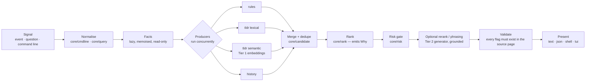

# 03 — Domain Model

> Status: **Implemented**. The Go shown is the shape of the real types in `internal/core`.

## 1. The one pipeline

The prototype has five overlapping engines: `internal/corrector`, `internal/smart`,
`internal/commandsearch`, `internal/historyml`, and `internal/performance`'s
matchers — each with its own scoring, its own notion of a result, and its own
merge logic (`internal/smart/engine.go:711 mergeSuggestion`,
`:730 mergeSourceLabels`). `Direct`.

WUT has **one** pipeline. Every user-facing operation is a different entry into
the same funnel.



Two properties fall out of this shape:

- **Adding a producer is additive.** A new source of candidates does not touch
  ranking, risk, or rendering.
- **The generator can never introduce a command.** It sits *after* merge and
  *before* validation, and it may only reorder and rephrase.
  See [06](06-intelligence-slm.md) §4.

## 2. Core types

```go
package core

// ─── Input ────────────────────────────────────────────────────────────────

// Event is what the shell tells WUT about a command that already ran.
// It is the ground truth the prototype never had.
type Event struct {
    ID        string        // ULID, monotonic
    Session   string        // shell session id, from the hook
    Seq       uint64        // per-session sequence
    At        time.Time
    Raw       string        // the command line as typed
    ExitCode  int
    Duration  time.Duration
    Cwd       string
    Shell     Shell
    Tier      CaptureTier   // T0 | T1 | T2 — see 04-shell-protocol.md
    Stderr    string        // empty unless Tier >= T1; capped, redacted
    StderrTrunc bool
}

// CommandLine is a parsed Event.Raw or a parsed user argument.
type CommandLine struct {
    Program    string
    Subcommand []string      // e.g. ["remote","add"] for git remote add
    Flags      []Flag
    Operands   []string
    Trailing   string        // pipes/redirects preserved verbatim, never parsed
    QuoteStyle QuoteStyle    // so a rewrite can be re-quoted correctly
}

// Facts is read-only runtime context about the working directory.
// Every field is lazy and memoised: a rule that never asks about git costs
// nothing in a non-git directory. See Assumption A1 in 01-vision-and-scope.md.
type Facts interface {
    Entries() []DirEntry
    IsDir(name string) bool
    Exists(name string) bool
    Git() GitFacts            // branch, upstream, remotes, branches
    NpmScripts() []string
    MakeTargets() []string
    Project() ProjectKind     // go | node | rust | python | docker | ...
}

// ─── Output ───────────────────────────────────────────────────────────────

// Candidate is the single currency of the system. Everything the user is
// ever shown is a Candidate.
type Candidate struct {
    Command    string        // the exact text that would be run
    Title      string        // one-line human summary
    Detail     string        // optional longer explanation
    Kind       Kind          // Correction | Recall | Explanation | Step
    Score      float64       // 0..1 after ranking
    Confidence Confidence    // Low | Medium | High — derived, user-visible
    Why        []Why         // never empty for a presented candidate
    Risk       Risk
    Source     Provenance
}

// Why is the reason this candidate exists and scored as it did.
// This is the U3 goal in 01-vision-and-scope.md made structural: a Candidate
// with no Why cannot be rendered.
type Why struct {
    Code   WhyCode   // stable, machine-readable
    Text   string    // human sentence, already localised
    Weight float64   // contribution to Score, signed
    Ref    string    // optional: rule id, tldr page, event id, file path
}

type Provenance struct {
    Producer  ProducerID   // rules | tldr-lexical | tldr-semantic | history
    Ref       string       // rule id, page name, event id
    Generated bool         // true if Tier 2 rephrased Title/Detail
}

// Risk is assigned by core/risk from a declarative policy, never ad hoc.
type Risk struct {
    Level  RiskLevel   // None | Caution | Destructive | Irreversible
    Class  []RiskClass // data-loss | privilege | network-mutating | remote-state
    Reason string
    Rule   string      // policy rule id, for auditability
}
```

### Why `Why` is a first-class type

In the prototype a suggestion carries a `Source` string label and a float score
(`internal/smart/engine.go:65`), and the labels are merged by string
concatenation (`:730`). The user sees a number they cannot interpret.

In WUT the renderer can always answer "why is this first?":

```
$ wut
  git push --set-upstream origin feature/login          ●●● high

    · branch 'feature/login' has no upstream            (git rev-parse)
    · 'origin' is the only remote                       (git remote)
    · rule git/push-no-upstream                         (confidence 0.95)

  [enter] run   [↑/↓] other candidates   [w] why   [esc] cancel
```

Every line under the command is a `Why` entry. Nothing is invented for
display.

## 3. Confidence is derived, not asserted

`Confidence` is a function of the ranked set, not of the top candidate alone:

| Condition | Confidence |
|---|---|
| Top score at or above 0.85 **and** gap to second at or above 0.25 | `High` |
| Top score at or above 0.55 | `Medium` |
| otherwise | `Low` |

`Low` changes the interaction rather than the wording: the picker opens with
nothing preselected and the header reads "I'm not sure — here's what I found."
This is UX goal U7.

## 4. The risk policy is data

The prototype scatters danger detection: 7 literal prefixes plus 2 regexes in
`internal/corrector/corrector.go:566-578`, and a separate 14-entry interactive
binary list in `evaluator.go:203-215`. `Direct`. Two lists, two places, no
tests binding them to behaviour.

WUT has one embedded policy file, versioned with the binary:

```yaml
# internal/core/risk/policy.yaml  (embedded via go:embed)
version: 1
rules:
  - id: fs/recursive-force-root
    level: irreversible
    class: [data-loss]
    match: { program: rm, flags_all: [-r, -f], operand_matches: '^/+$|^~/?$' }
    reason: "Deletes the filesystem root."

  - id: vcs/history-rewrite
    level: destructive
    class: [remote-state]
    match: { program: git, subcommand: [push], flags_any: [--force, -f] }
    reason: "Overwrites remote history for everyone on this branch."

  - id: pkg/publish
    level: irreversible
    class: [remote-state, network-mutating]
    match: { any_of: [{program: npm, subcommand: [publish]},
                      {program: cargo, subcommand: [publish]}] }
    reason: "Publishes to a public registry. Most registries do not allow unpublish."
```

Properties this buys:

- Every rule has an `id` that appears in `Risk.Rule`, so a user can ask
  `wut risk explain vcs/history-rewrite`.
- Rules are testable as a table without constructing a `Corrector`.
- A user can extend the policy in `~/.config/wut/risk.d/*.yaml`. User rules can
  only **raise** a level, never lower one — a safety property, enforced at load.

## 5. Correction rules are data too

DX goal D2: adding a correction must not require writing Go.

```yaml
# internal/core/correct/rules/git.yaml
- id: git/push-no-upstream
  when:
    program: git
    subcommand: [push]
    no_flags: [--set-upstream, -u]
    facts:
      git.in_repo: true
      git.has_upstream: false
      git.remote_count: 1
  rewrite: "git push --set-upstream {{ .Git.Remote }} {{ .Git.Branch }}"
  why:
    - code: git.no_upstream
      text: "branch '{{ .Git.Branch }}' has no upstream"
      ref: "git rev-parse --abbrev-ref @{u}"
  confidence: 0.95
```

The Go side is a small evaluator plus a golden-file harness:
`testdata/git/push-no-upstream/{facts.json,input.txt,want.txt}`. Contributors
add a directory, not a function.

Rules declare which facts they need. The evaluator collects the union of
required facts once, so probes run at most once per invocation.

## 6. Kinds map to commands

| `Kind` | Produced by | Surfaced as |
|---|---|---|
| `Correction` | `core/correct` from an `Event` or an argument | bare `wut` after a failure, `wut fix` |
| `Recall` | tldr lexical + semantic producers | `wut <question>`, `wut ui` |
| `Explanation` | tldr page + Tier 2 phrasing, grounded | `wut explain` |
| `Step` | a `Recall` chain over one goal | `wut do`, not built |

One type, four presentations. The prototype has `Correction`
(`internal/corrector/corrector.go:16`) and `Suggestion`
(`internal/smart/engine.go:65`) as separate structs with separate merge rules.
`Direct`.

## 7. What is deliberately *not* modelled

- **No `Session` aggregate.** Events carry a session id; nothing owns a session
  object. Shell sessions end without notice; an aggregate would rot.
- **No user profile / learned model of the user.** History influences ranking
  through explicit, inspectable `Why` entries only. The prototype's
  `internal/historyml/ranker.go` trains a scoring model whose output the user
  cannot see or contest; that is dropped.
- **No plugin ABI.** Owner chose "binary + daemon", not "binary + plugins".
  Extension happens by adding a `KnowledgeSource` adapter in-tree.
