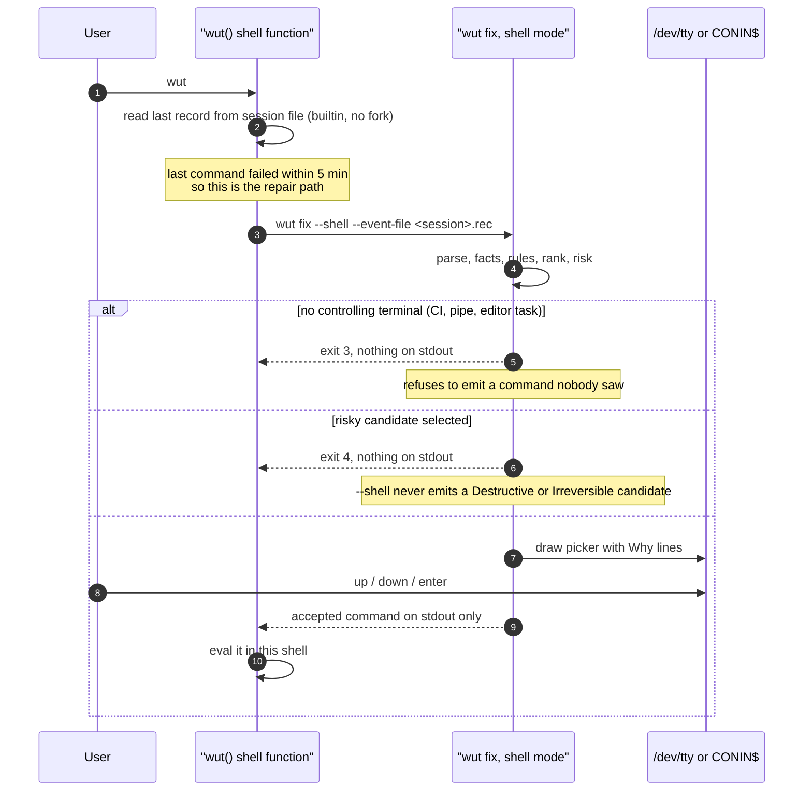

# 04 — Shell Protocol

> Status: **Implemented**. This is the largest single DX/UX change in WUT.

## 1. The problem being solved

The prototype cannot see what your shell did. Its options were:

| The prototype approach | Where | Cost |
|---|---|---|
| Re-run your command to read stderr | `evaluator.go:170-172` (removed) | Audit finding **C1, Critical** — `oops` after `git push` pushed again |
| Ask you to pipe it: `cmd 2>&1 \| oops` | `cmd/fix.go` `--stderr` | Works, but nobody remembers to do it before the command fails |
| Probe the filesystem for facts | `internal/corrector/facts.go` | Good, but recovers only part of the signal |

All three exist because the shell never told WUT anything. `Direct`.

**WUT inverts this.** The shell records what happened, at the moment it happens,
at zero subprocess cost. WUT reads that record when the user asks.

## 2. Design constraints

| # | Constraint | Consequence |
|---|---|---|
| C1 | The prompt must not get slower. A user notices about 20 ms. | The hook may **not** spawn a process per command. |
| C2 | WUT must never execute the user's command (invariant B1). | Recording is passive; it observes, it does not wrap. |
| C3 | The hook must not break other shell extensions. | No `command_not_found` replacement without an opt-in; no `PROMPT_COMMAND` clobbering; append-only, and detect existing frameworks. |
| C4 | stderr can contain secrets. | Capture is opt-in, capped, redacted, local-only, and expires. |
| C5 | Nine shells with wildly different capabilities. | Capability tiers, honestly documented, with graceful degradation. |

C1 rules out the obvious design (`wut record ...` after every command). A
process spawn costs roughly 5–15 ms on Linux and considerably more on Windows.

## 3. The transport: a session record file

The hook writes one record using **shell builtins only** — no fork, no exec.

```
$WUT_STATE_DIR/sessions/<session-id>.rec
```

Record format, chosen so pure `printf` can emit it correctly without any
JSON escaping:

```
<field> US <field> US ... US <raw command> RS
   US = 0x1F (unit separator)   RS = 0x1E (record separator)
```

Fields, in order:

| # | Field | Example |
|---|---|---|
| 1 | schema version | `1` |
| 2 | sequence | `41` |
| 3 | unix millis at start | `1756100000123` |
| 4 | duration millis | `240` |
| 5 | exit code | `1` |
| 6 | shell id | `zsh` |
| 7 | cwd | `/home/t/proj` |
| 8 | capture tier | `T0` |
| 9 | raw command (last, may contain newlines) | `git psuh -u origin main` |

The raw command is last and the record is `RS`-terminated, so an embedded
newline needs no escaping. This is what makes a zero-spawn hook possible in
bash.

Cost of the hook per command: one `printf` builtin and one arithmetic
expansion. Measured target: **under 1 ms**, no fork.

### File lifecycle

- One file per shell session, created on first command.
- Capped at 512 records (ring, rewritten in place by WUT, not by the shell) and
  at 1 MiB.
- Deleted when the shell exits (`trap EXIT` / `atexit` equivalent) and, as a
  backstop, swept by `wut` on startup: any session file untouched for 7 days,
  or whose owning PID is gone, is removed.
- `0600`, inside the state directory. Never in `/tmp`.

### Who reads it

- The CLI reads the tail of the current session's file when it needs the last
  event. Cost: one open + one read of the last 4 KiB.
- The daemon, if running, tails all session files and keeps recent events in
  memory and in the event store — which is what makes `wut history` and
  history-informed ranking instant.
- If the daemon is off, the CLI ingests records into the event store
  opportunistically, batched, on any invocation.

## 4. Capture tiers

| Tier | Contains | Default | Risk |
|---|---|---|---|
| **T0** | argv, exit code, cwd, duration, shell, timestamp | **On** after `wut shell install` | None. No output is read. |
| **T0.5** | T0 plus the fact that the command was *not found*, and the name that was not found | **On** where the shell has a native `command_not_found` hook | None. This is a callback the shell offers; nothing is intercepted. |
| **T1** | T0 plus captured stderr | **Off.** `wut shell capture on` | Redirection or a native hook. Caveats are per-shell, below. |
| **T2** | Explicit: `cmd 2>&1 \| wut` | Always available | None. The user chose it. |

T0 plus T0.5 plus project facts already covers the large majority of real
corrections: a typo'd program name is T0.5, a typo'd subcommand or flag is
parseable from argv alone, and `git push` with no upstream is a fact probe.
**T1 is an enhancement, not a foundation.** That is deliberate — it means the
feature set does not depend on the riskiest capability.

## 5. Support classes

Owner decision **D6**: no shell is dropped, and no shell is promised more than
it can deliver. Every supported shell is declared in one of three classes, in
the README, in `wut shell install`, and in `wut doctor`.

| Class | Shells | What the user gets | What is owed |
|---|---|---|---|
| **Full** | zsh · fish · PowerShell 7 · Windows PowerShell · nushell · xonsh · elvish | T0 and T0.5 automatically after `wut shell install`. Bare `wut` works with no arguments. | Must pass the container matrix ([09](09-quality-release.md) §4) |
| **Full — later** | bash | The same, but the `DEBUG` trap has to coexist with `bash-preexec`, oh-my-bash, and Starship. Shipped when that coexistence is verified, not before. | Documented as Manual until a green matrix run says otherwise |
| **Manual** | sh · dash · ash · ksh · mksh · yash · posh · cmd.exe | No automatic capture — these shells have no usable hook surface. `wut fix "<command>"` and `cmd 2>&1 \| wut` work exactly as well as anywhere else. | A thin function/macro definition only. No matrix obligation. |

The Manual class costs almost no code — a shell function or a DOSKEY macro —
so keeping it loses nothing and dropping it would lose users for no gain. What
would be wrong is letting a Manual-class user believe bare `wut` will know what
just failed. `wut doctor` states the achieved class and tier explicitly.

### Per-shell capability matrix

Every row is derived from that shell's documented hook surface and must be
exercised against a live session before it counts. `scripts/shell-matrix.sh`
is that exercise; a row nothing has run is a claim, not a capability.

| Shell | T0 mechanism | T0.5 | T1 | Notes |
|---|---|---|---|---|
| **zsh** | `preexec` + `precmd` hook arrays | `command_not_found_handler` | tee via `exec 2> >(...)`, opt-in | Cleanest surface of all nine. Appends to `precmd_functions`, never overwrites. |
| **bash** | `trap DEBUG` for start, `PROMPT_COMMAND` append for end | `command_not_found_handle` | tee via process substitution, opt-in | Must cooperate with `bash-preexec` and Starship if present — detect and chain. |
| **fish** | `fish_preexec` / `fish_postexec` events | `fish_command_not_found` | `--on-event` cannot see stderr; T1 unavailable | Native events, no globals touched. |
| **PowerShell 7 / Windows PowerShell** | `prompt` function wrapper + `Get-History -Count 1` (`StartExecutionTime`, `EndExecutionTime`, `ExecutionStatus`) | `CommandNotFoundAction` | `$Error[0]` gives the last error record — effectively T1 for PS-native failures, no redirection | The prototype had a real bug here: it read `Get-History -Count 2` at index 0, which is oldest-first, so it targeted the wrong command (audit §11.3). WUT indexes from the end. |
| **nushell** | `$env.config.hooks.pre_execution` / `pre_prompt`, `$env.LAST_EXIT_CODE` | `command_not_found` hook | Not available | Hooks are config values; WUT appends to the list. |
| **xonsh** | `on_precommand` / `on_postcommand` events | `on_command_not_found` | **Native.** `on_postcommand` receives `out` and `err`. | The only shell where T1 is free and safe. |
| **elvish** | `$edit:after-command` (`$m[duration]`, `$m[error]`) | via `$edit:command-not-found` | Error object only, not stderr text | |
| **sh / dash / ash / ksh / mksh / yash / posh** | POSIX: no `DEBUG` trap in dash. `PS1`-embedded command substitution would spawn a process — rejected under C1. | No | No | **Manual class.** `wut fix "<command>"` and `cmd 2>&1 \| wut`. Declared, not hidden. |
| **cmd.exe** | No hook surface. DOSKEY macros only. | No | No | **Manual class.** A DOSKEY macro maps `wut` to the binary; there is no event context to read. |

`wut doctor` reports the support class **and** the achieved tier per installed
shell, so the user always knows what WUT can see.

## 6. Privacy and redaction for T1

Applied before a byte is written, in the hook where possible and in
`app/record` always:

1. **Cap**: 16 KiB of stderr per event, tail-biased (errors end with the useful
   part).
2. **Redact** by pattern, on by default, extendable in config:
   `AKIA[0-9A-Z]{16}`, `ghp_[A-Za-z0-9]{36}`, `gh[pousr]_`, `sk-[A-Za-z0-9]{20,}`,
   `-----BEGIN [A-Z ]*PRIVATE KEY-----`, `Bearer [A-Za-z0-9._~+/-]{20,}`,
   `password=`, `token=`, `Authorization:`, any value of an env var whose name
   matches `(?i)(secret|token|password|key|credential)`.
3. **Retention**: T1 payloads expire after 24 hours by default
   (`capture.retention`), independent of the event record itself.
4. **Never leaves the machine.** Non-goal in [01](01-vision-and-scope.md) §5,
   invariant B5 in [02](02-architecture-overview.md) §2.
5. `wut capture status` shows exactly what is stored right now;
   `wut capture purge` deletes it.

## 7. The repair interaction — bare `wut`

The prototype's `oops` is gone as a name (owner decision **D8**,
[ADR-0013](10-decision-records.md)) but its one genuinely good property is
preserved verbatim: **the picker draws on the controlling terminal, and stdout
carries only the accepted command**. That separation is what lets the user's own
shell run the result, so `cd` and `export` take effect as if they had typed it
(audit §11.3). `Direct`.

To make that work for bare `wut`, the managed rc block defines `wut` as a
**shell function** that wraps the binary — the same well-understood pattern
`nvm`, `zoxide`, and `conda` use. `command wut` always reaches the binary
directly, and the function delegates to it for every path except the one that
needs to `eval` a result in the current shell.



Changes from the prototype:

- The command is read from the **session record**, not from `fc`/`Get-History`
  string scraping. That removes an entire class of bug (the prototype's PowerShell
  off-by-one, and the `oops`-skipping-`oops` heuristics in the bash hook at
  `internal/shell/installer.go:333-354`, which existed only because history
  scraping cannot tell WUT's own invocations apart from real commands).
- The picker shows `Why` lines under each candidate (U3).
- Exit codes are part of the contract, so wrappers can react: `0` accepted,
  `1` error, `2` nothing found, `3` no TTY, `4` refused as risky, `130` cancelled.

## 8. rc file management

Carried over as a *requirement*, rebuilt as code:

- One managed block, delimited and versioned:
  `# >>> wut WUT managed block >>>` … `# <<< wut WUT managed block <<<`.
- Backup before write, restore on failure, verified by test (the prototype had
  `installer_test.go` covering backup/restore — keep that coverage, drop the
  implementation).
- `wut shell install --dry-run` prints the exact diff.
- Idempotent: re-running replaces the block, never appends a second one.
- `wut shell uninstall` removes the block and the session files.
- **the prototype blocks are not touched.** Per owner decision D2 there is no shim; a the prototype
  block referencing the prototype subcommands simply stops working, and `wut doctor`
  detects it and tells the user to run `wut shell install`.

## 9. Questions this design raised, and how they were settled

| # | Question | Settled |
|---|---|---|
| Q4 | Does the zero-spawn record file survive real-world `set -e`, subshells, and `bash-preexec` coexistence in every target shell? | **Verified per shell by `scripts/shell-matrix.sh`**, which sources the real hook in each shell, runs a failing command, and asserts the record. It runs in CI for the shells the runner can install; the rest need the container matrix, and any shell not covered by a green run is documented as unverified rather than assumed working. |
| Q5 | Should T0 be on by default after install, or require an explicit opt-in? | **T0.5 on, T1 off.** T0.5 records what happened and the name of a command that was not found — no output is read. T1 is the only tier that reads output and it stays off until the user asks for it with `wut shell capture T1`. |
| Q6 | For POSIX sh and cmd.exe, is a degraded experience acceptable, or should they be dropped to avoid promising what cannot be delivered? | **Kept, in a declared class** — owner decision D6. They are listed as Manual, `wut doctor` says so on that machine, and nothing in the documentation implies bare `wut` will work there. |
