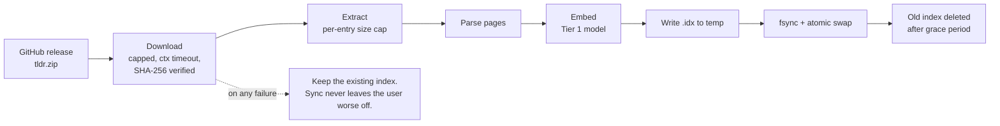

# 07 — Storage & Configuration

> Status: **Implemented**. Owner decision **D2**: clean break, no migration from the prototype.

## 1. Two stores, because there are two access patterns

The prototype puts everything in one bbolt file: tldr pages, metadata, history, bookmarks
(`internal/db/storage.go:16-17`, plus history and bookmark buckets). `Direct`.
That is one data structure serving two workloads with opposite shapes.

| Workload | Shape | The prototype | WUT |
|---|---|---|---|
| **Knowledge** — tldr pages and their embeddings | Write once per sync, read constantly, never mutated, needs contiguous float arrays for vector scan | bbolt B-tree, one KV per page | **Packed immutable index file, mmapped** |
| **State** — events, bookmarks, aliases, sync metadata | Small, mutated constantly, needs transactions | bbolt | **bbolt** (kept — pure Go, proven, already understood) |

Splitting them also makes the knowledge index a *replaceable artifact*: it can
be rebuilt, shipped, diffed, or corrupted-and-redownloaded without touching a
single byte of user state.

## 2. The knowledge index

```
$WUT_DATA_DIR/knowledge/wut-<schema>-<contenthash>.idx
```

Layout, mmapped read-only:

```
┌────────────────────────────────────────────────────────────┐
│ Header    magic "WUTIDX\0" · schema u16 · flags u16         │
│           built_at u64 · tldr_release string                │
│           page_count u32 · vec_count u32 · vec_dim u16      │
│           section offsets + lengths + CRC32C per section    │
├────────────────────────────────────────────────────────────┤
│ Pages     length-prefixed page blobs, zstd per block        │
│           (name, platform, description, examples)            │
├────────────────────────────────────────────────────────────┤
│ Vectors   vec_count × vec_dim int8, contiguous              │
│           + per-vector scale f32                            │
├────────────────────────────────────────────────────────────┤
│ Postings  lexical inverted index: term → page ids           │
├────────────────────────────────────────────────────────────┤
│ Names     sorted page names + platform, for exact lookup     │
└────────────────────────────────────────────────────────────┘
```

Properties this buys:

- **Vector scan is a single contiguous read.** 25,000 × 256 int8 = 6.4 MB, one
  pass, under 2 ms. No ANN library, no dependency.
- **Atomic swap.** A sync writes a new file and flips a `current` symlink (or a
  pointer file on Windows). A half-written index is never observed. Readers
  holding the old mmap keep working until they exit.
- **Corruption is detectable and recoverable.** CRC32C per section; a bad
  section triggers "index damaged, run `wut db sync`" instead of a panic.
  the prototype had ~15 unguarded `tx.Bucket(...)` dereferences that panicked on a
  malformed database (audit M8, since fixed with `requireBucket`).
- **The index is derived data.** It can always be deleted. Nothing the user
  created lives here.

### Sync pipeline



Carried forward from the prototype's fixes because they were the right calls (audit §8):
separate HTTP client for archive downloads with `ResponseHeaderTimeout` rather
than a whole-exchange timeout (C2), `io.LimitReader` on both the download and
each zip entry (H4), and no dependency on the process working directory (H5).

`--from-dir` remains available for offline/air-gapped builds, but only as an
explicit flag — never as an implicit fallback, which was the H5 defect.

## 3. The state store

`$WUT_STATE_DIR/state.db`, bbolt.

| Bucket | Key | Value | Retention |
|---|---|---|---|
| `events` | `<ULID>` | encoded `core.Event` | ring, `history.max_entries` (default 20,000) |
| `events_by_cwd` | `<cwd-hash>/<ULID>` | — | index, follows `events` |
| `stderr` | `<event ULID>` | redacted, capped payload | `capture.retention`, default 24 h |
| `bookmarks` | `<ULID>` | command + label + tags | forever, user-owned |
| `aliases` | `<name>` | expansion + provenance | forever, user-owned |
| `meta` | `schema`, `last_sync`, `index_hash`, `daemon_token` | | |

Rules:

- Every bucket access goes through a `requireBucket` equivalent. No nil
  dereference is reachable. (audit finding M8, generalised into the storage adapter so
  it cannot regress.)
- Retention is enforced on write, not by a sweeper, so a machine that is never
  idle still trims.
- **`wut purge` deletes everything WUT ever recorded**, in one command, and
  says exactly what it removed. Privacy is not a settings-menu feature.

## 4. Filesystem layout

Platform-correct directories via a `platform/paths` package — no `~/.wut`
sprawl.

| Purpose | Linux/BSD | macOS | Windows |
|---|---|---|---|
| Config | `$XDG_CONFIG_HOME/wut` | `~/Library/Application Support/wut` | `%APPDATA%\wut` |
| Data (index, models) | `$XDG_DATA_HOME/wut` | `~/Library/Application Support/wut` | `%LOCALAPPDATA%\wut` |
| State (db, sessions, socket) | `$XDG_STATE_HOME/wut` | `~/Library/Application Support/wut` | `%LOCALAPPDATA%\wut\state` |
| Cache | `$XDG_CACHE_HOME/wut` | `~/Library/Caches/wut` | `%LOCALAPPDATA%\wut\cache` |

All four are overridable by `WUT_CONFIG_DIR`, `WUT_DATA_DIR`, `WUT_STATE_DIR`,
`WUT_CACHE_DIR` — which is also how the test suite gets full isolation without
touching the developer's real state.

## 5. Configuration

### The prototype problem · `Direct`

- Global viper singleton, read by 17 files (`internal/config/config.go`).
- Reads go through viper, writes go through `yaml.Marshal` + `os.WriteFile`
  (audit M7) — an asymmetry that bakes env-only keys into the file.
- 30+ flat keys across 8 namespaces (`config.go:289-331`), most of which no
  user has ever changed.

### The WUT design

```go
// internal/core/config — a plain struct. No framework.
type Config struct {
    Capture  Capture  `yaml:"capture"`
    Knowledge Knowledge `yaml:"knowledge"`
    Model    Model    `yaml:"model"`
    Daemon   Daemon   `yaml:"daemon"`
    UI       UI       `yaml:"ui"`
    History  History  `yaml:"history"`
}
```

| Property | Rule |
|---|---|
| Precedence | defaults → `config.yaml` → `WUT_*` env → flags. One direction, documented, tested. |
| Injection | `Config` is a value passed into `app` constructors. No package-level state anywhere. |
| Writes | Marshal the same struct that was read. Atomic (temp + `fsync` + rename, `0600`), Windows rename-over handled — the prototype fix (audit M7) is a requirement, not a patch. |
| Unknown keys | Rejected at load with the offending line number, not silently ignored. |
| Surface | Target **under 15 keys**. Every key must have a user story; a key that only exists because it was easy to add gets deleted. |
| Editing | `wut config get/set/edit/reset`, plus `wut config explain <key>` which prints what the key does and what it currently resolves to and *why* (file? env? default?). |

No viper. Removing it drops `spf13/viper` plus its transitive
`afero`, `cast`, `mapstructure`, `pelletier/go-toml`, `sagikazarmark/locafero`,
`subosito/gotenv`, and `fsnotify` from the module graph.

### Proposed key set

```yaml
capture:
  tier: T0            # T0 | T0.5 | T1 | off
  retention: 24h
  redact: [ ]         # extra regexes, merged with built-ins
knowledge:
  auto_sync: true
  sync_interval: 168h
model:
  tier1: auto         # auto | off | <path>
  tier2: off          # off | auto | ollama | <path>
  max_rss: 1400MB
daemon:
  autostart: false
  idle_timeout: 30m
ui:
  theme: auto         # auto | light | dark | none
  output: text        # text | json
history:
  enabled: true
  max_entries: 20000
shell:
  alias: ""           # optional extra trigger, e.g. "uh". Empty by default.
```

15 keys. The prototype has 30+. `shell.alias` exists because owner decision **D8** removed
`oops`: users who want a two-keystroke trigger add their own, and it is a
preference rather than a second concept the product has to teach
([ADR-0013](10-decision-records.md)).

## 6. Schema versioning

| Artifact | Version field | On mismatch |
|---|---|---|
| Knowledge index | `schema` in the header | Rebuild from the archive. It is derived data; never migrate it. |
| State db | `meta/schema` | Forward migrations only, one function per step, each with a test. This is the only place migration logic exists. |
| Config | `version` key | Additive changes need no migration; a removed key produces a warning naming the key and the release that removed it. |
| Session record | field 1 | A record with an unknown version is skipped, not an error. |
| IPC | handshake | Client falls back to in-process ([05](05-daemon.md) §3). |

## 7. Questions this design raised, and how they were settled

| # | Question | Settled |
|---|---|---|
| Q9 | Should saved commands and aliases be plain YAML so they can live in a dotfiles repo? | **Yes**, and they are not merely exportable — `saved.yaml` *is* the storage. It sits next to the config, is written atomically, and `wut purge` does not touch it, because it is the one store where losing a file loses something the user cannot get back. |
| Q10 | Windows has no symlink guarantee for the index pointer. Pointer file plus retry, or hardlink? | **Neither: there is no pointer.** The index is one path, replaced by an atomic write. A reader either maps the old file or the new one, and the failure a pointer was meant to solve cannot occur. |
