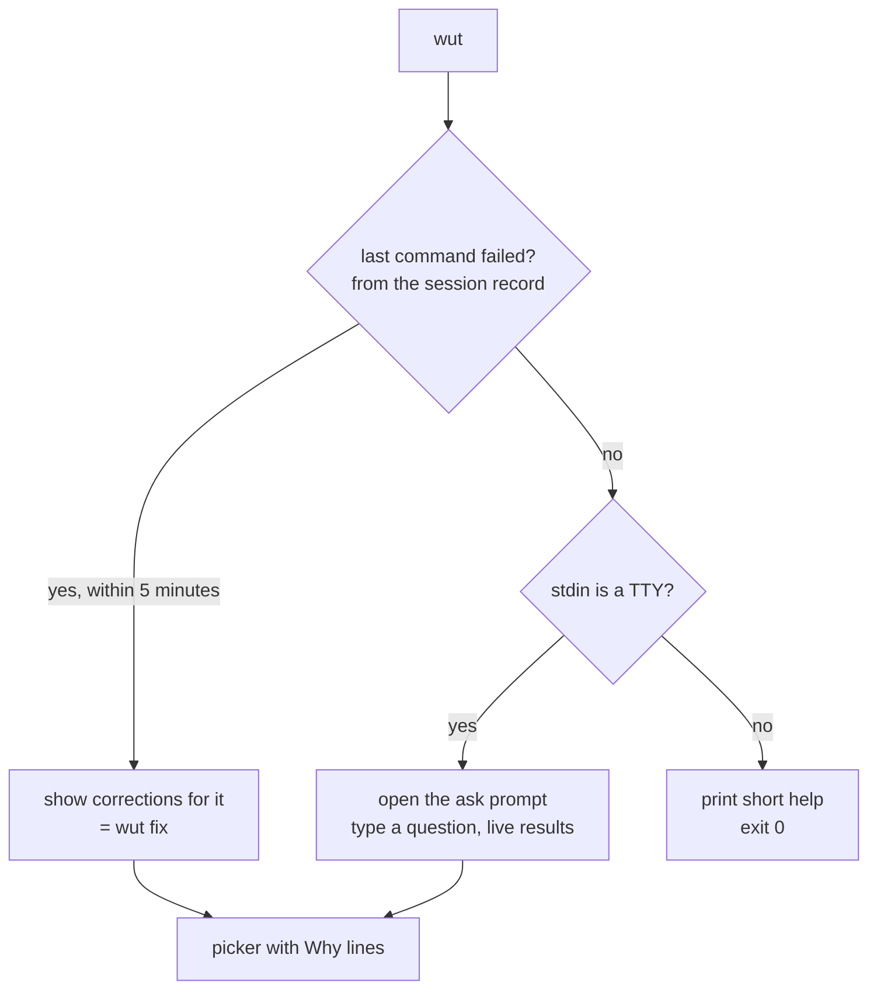

# 08 — CLI Surface & UX

> Status: **Implemented**.

## 1. The prototype surface, measured · `Direct`

37 `Use:` declarations. Nine of them are a duplicate command tree in
`cmd/shortcuts.go` re-declaring `terminal`, `suggest`, `history`, `explain`,
`alias`, `config`, `db`, `fix`, `smart` as `t`, `s`, `h`, `x`, `a`, `c`, `d`,
`f`, `?` — each with its own flags. Five different commands can produce a
suggestion.

A user cannot hold that in their head, and neither can a contributor.

## 2. The WUT surface

**One name. 17 commands. One mental model: you ask, WUT answers, you decide.**

There is no second command to learn — no `oops`, no `f`, no `?`. Owner decision
**D8**: `wut` is the whole vocabulary ([ADR-0013](10-decision-records.md)).

```
wut                          the answer is context-dependent — see §3
wut <anything you type>      ask in natural language
wut ask <question>           the same, when the question starts with a command name
wut fix [command]            correct a *specific* command (bare wut covers the last one)
wut explain <command>        explain what a command does                alias: x
wut ui [question]            the interactive terminal UI                alias: u
wut history                  what your shell has told WUT               alias: h
wut save [command]           keep a command you want to find again      alias: b
wut alias                    manage shorthands                          alias: a
wut db sync|status|clear     the knowledge index                        alias: d
wut model status|list        the optional Tier 2 model
wut risk check|list          the safety policy
wut rules list               the correction rules
wut shell install|uninstall|status|capture|hook   shell integration
wut daemon start|stop|status|run      the opt-in daemon
wut config show|get|set|explain|path  configuration                     alias: c
wut doctor                   diagnose this installation
wut purge                    delete everything WUT has recorded
wut version                  print the version
```

Aliases are declared with Cobra's `Aliases:` field **on the command itself**.
There is no second tree. That deletes `cmd/shortcuts.go` and its duplicated
flag wiring outright.

### The mapping from the prototype

| Prototype | WUT | Why |
|---|---|---|
| `suggest`, `smart`, `s`, `?` | `wut <question>` | Four entry points to one idea |
| `terminal`, `t` | `wut ui` | "Terminal" was confusing — WUT is not a terminal |
| `fix`, `f`, `oops` | bare `wut` (last command) / `wut fix <cmd>` (a specific one) | The name `oops` is retired — see [ADR-0013](10-decision-records.md) |
| `explain`, `x` | `wut explain` | Kept |
| `pro-tip` | folded into `wut explain` output | It was a separate command for one extra paragraph |
| `undo` | folded into `wut fix` | Undo is a correction with a different direction |
| `bookmark add/remove/search` | `wut save`, `wut history --saved` | Three subcommands for one list |
| `stats` | `wut history --stats` | A view of history, not a separate concept |
| `init` | first-run flow inside `wut shell install` | A 327-line wizard (audit M13) that existed because setup was hard. WUT makes setup one command. |
| `install` | `wut shell install` | Ambiguous — it installed *hooks*, not WUT |
| `bug-report` | `wut doctor --report` | Doctor already collects the same information |
| `db sync/status/clear/update` | `wut db sync/status/clear` | `update` and `sync` did nearly the same thing |
| — | `wut model`, `wut daemon`, `wut purge` | New |

37 → 17 top level, and nine of the prototype's were a duplicate alias tree. Nothing in the "Kept" list of
[01](01-vision-and-scope.md) §3 is lost.

## 3. Bare `wut` is context-aware

This is the UX centrepiece (goal U1). Running `wut` with no arguments does the
most useful thing given what just happened:



There is no state to learn and no flag to remember. The failure case — the one
that matters — needs zero typing beyond three letters, and those three letters
are the program's own name.

This is why `oops` was removed rather than shortened. A second name would have
to be learned, advertised, remembered, and kept from colliding with the user's
own aliases — all to reach a path that `wut` already reaches. The shortest
command is the one that does not exist.

**If a user still wants a two-key trigger**, `shell.alias` in the config adds
one (`uh`, `ww`, whatever they like) to the managed rc block. That is a
preference, not a second concept, and it is not advertised in the first-run
flow.

## 4. Output contract

Every command supports `--output`:

| Mode | For | Guarantee |
|---|---|---|
| `text` (default) | Humans at a TTY | Styled, adapts to width, respects `NO_COLOR` and `TERM=dumb` |
| `json` | Scripts, editors, other agents | Conforms to a **versioned schema in `pkg/wutjson`**. Additive changes only within a major version. |
| `shell` | The `wut()` shell function | **Only the accepted command on stdout.** Everything else on the controlling terminal. |

This is DX goal D5 and it is what the prototype lacks entirely. It also makes golden-file
testing of the CLI trivial: assert on `--output json`, not on styled text.

```jsonc
// wut fix --output json
{
  "schema": "wut.v1.result",
  "kind": "correction",
  "confidence": "high",
  "candidates": [
    {
      "command": "git push --set-upstream origin feature/login",
      "title": "Push and set the upstream branch",
      "score": 0.95,
      "risk": { "level": "none" },
      "source": { "producer": "rules", "ref": "git/push-no-upstream", "generated": false },
      "why": [
        { "code": "git.no_upstream", "text": "branch 'feature/login' has no upstream",
          "weight": 0.6, "ref": "git rev-parse --abbrev-ref @{u}" },
        { "code": "git.single_remote", "text": "'origin' is the only remote",
          "weight": 0.2, "ref": "git remote" }
      ]
    }
  ]
}
```

## 5. Exit codes are an API

| Code | Meaning |
|---|---|
| 0 | Success; a candidate was produced (and accepted, in `--shell` mode) |
| 1 | Internal error |
| 2 | Usage error (bad flags) |
| 3 | No candidate found, or `--shell` with no controlling terminal |
| 4 | Refused: the only candidate was `Destructive` or `Irreversible` and the mode forbids emitting it |
| 5 | Knowledge index missing or damaged — run `wut db sync` |
| 130 | Cancelled by the user |

The prototype returned errors as strings and called `os.Exit(1)` inside
`PersistentPreRunE`, which skipped `PersistentPostRun` and every pending
`defer` including `storage.Close()` (audit M10). In WUT `main` is the only place
that exits.

## 6. The picker

The shared interaction for every command that produces more than one
candidate. Drawn on the controlling terminal, never stdout.

```
  wut · git psuh -u origin main  failed (exit 1, 0.2s)

▸ git push -u origin main                                    ●●● high
    · 'psuh' is 1 edit from 'push'                     rule typo/program
    · 'push' is the most used git subcommand here      42 uses, last 2h ago

  git push --set-upstream origin main                        ●●○ medium
    · branch 'main' has no upstream                    git rev-parse

  ↑↓ choose   ⏎ run   w why   e edit   esc cancel
```

- `w` expands every `Why` entry with its `ref`.
- `e` drops the candidate into the shell's line editor instead of running it —
  the "almost right" escape hatch, which the prototype had no answer for.
- Risky candidates are shown with an explicit marker and require a second
  confirmation. In `--shell` mode they are not emitted at all.
- Low confidence: nothing is preselected and the header says so (goal U7).

## 7. First run

One command, no wizard:

```
$ wut shell install
  detected  zsh (active), bash, fish
  will add  a managed block to ~/.zshrc, ~/.bashrc, ~/.config/fish/config.fish
  capture   T0 — command, exit code, directory, duration. No output is read.
  knowledge not installed — 4,013 pages, ~28 MB

  [y] install everything   [s] pick shells   [d] show the exact diff   [n] cancel
```

Then:

```
  done. open a new shell, or: source ~/.zshrc
  try:  wut how do I squash the last 3 commits
        wut           on its own, right after a command fails
```

Replaces the prototype's `runInit` (327 lines before decomposition, audit M13) plus a
separate `install` command. Non-interactive: `wut shell install --yes
--shells zsh,bash`. Piped input works — the prototype's `askYN`/`askChoice` silently
discarded piped answers because each built a new `bufio.Scanner` over stdin
(audit H3); WUT has one reader, and a test that pipes three answers and asserts
all three land.

## 8. Terminal UI (`wut ui`)

Scope deliberately smaller than the prototype's, which had TUIs in four places
(`cmd/history.go`, `cmd/config.go`, `cmd/suggestions_view.go`,
`internal/db/tui.go`) — including one inside the persistence package.

WUT has **one** TUI, `render.UI` in `internal/adapter/render/tui.go`, with three
panes:

1. **Ask** — type, see live candidates with `Why` under the selected one.
2. **History** — what the shell reported, and how each command went. Enter on a
   past command loads it into the question box, which is the repair path: you
   scroll back to what went wrong and ask about it.
3. **Knowledge** — the tldr page behind the selected answer, offline.

Everything else (`config`, `alias`, `save`) is a plain command. A TUI for
editing seventeen config keys is not worth 292 lines (the prototype
`runConfigUI`, audit §8).

**No TUI framework.** The design originally called for the Charm stack
(`bubbletea`, `lipgloss`, `bubbles`); that was dropped. Those three pull in
roughly a dozen transitive dependencies to draw what this needs — an alternate
screen buffer, a list, and a text field — and the picker already had raw-mode
terminal handling and a style layer that work. Three direct dependencies is a
number worth defending. The cost is real and worth stating: there is no layout
engine, so pane sizing is arithmetic, and there is no mouse support.

The UI knows nothing about use cases. Search, history, page lookup, and save
all arrive as functions, so it cannot reach a store, cannot run a search of its
own, and cannot grow a second way of doing something the CLI already does.
That constraint is what keeps one TUI from becoming four.

## 9. Accessibility and environment

| Condition | Behaviour |
|---|---|
| `NO_COLOR` set, or `TERM=dumb`, or not a TTY | Plain text, no ANSI, no spinner |
| Narrow terminal (under 40 cols) | Single-column layout, `Why` lines wrapped, never truncated mid-word |
| Screen reader / `WUT_PLAIN=1` | No box drawing, no relative cursor movement; each candidate on its own labelled line |
| CI (`CI=true`) | `--output json` becomes the default; no picker, no TTY assumptions |
| Windows Terminal / conhost | Detected; falls back to ASCII glyphs where the code page cannot render the Unicode set |

## 10. Documentation as a deliverable

The prototype README is 29,711 bytes and duplicates the CLI help for every command.
It will drift, and it has (audit §8: the README promised "WUT never executes
commands" while the code did).

WUT:

- `README.md` — under 200 lines: what it is, install, five examples, links.
- `wut help <command>` and `--help` are the reference. Generated docs
  (`docs/cli/*.md`) come from the Cobra tree at release time, so they cannot
  drift.
- `docs/architecture/` — this directory, kept current as milestones land.
